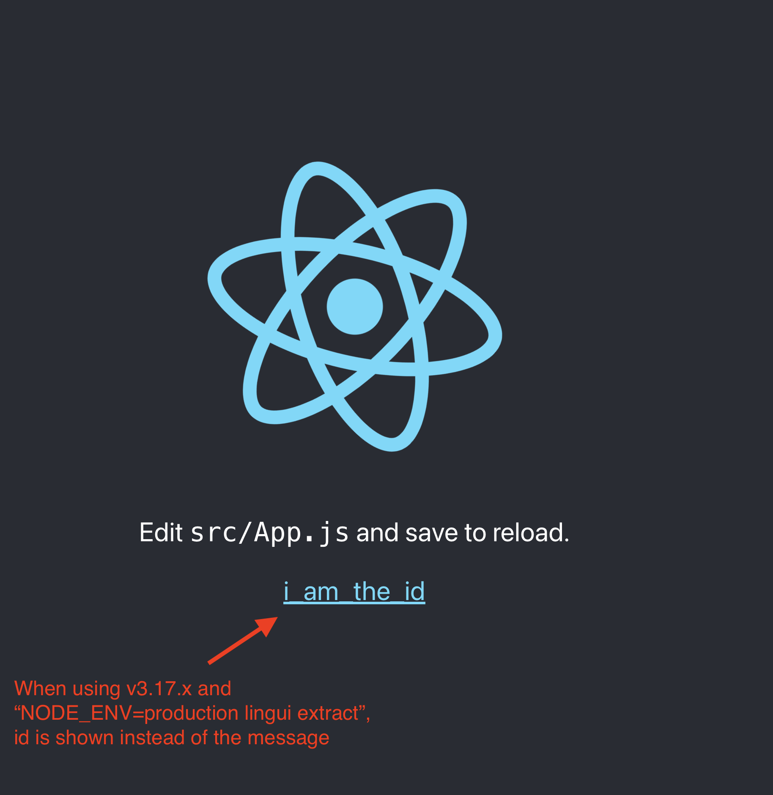
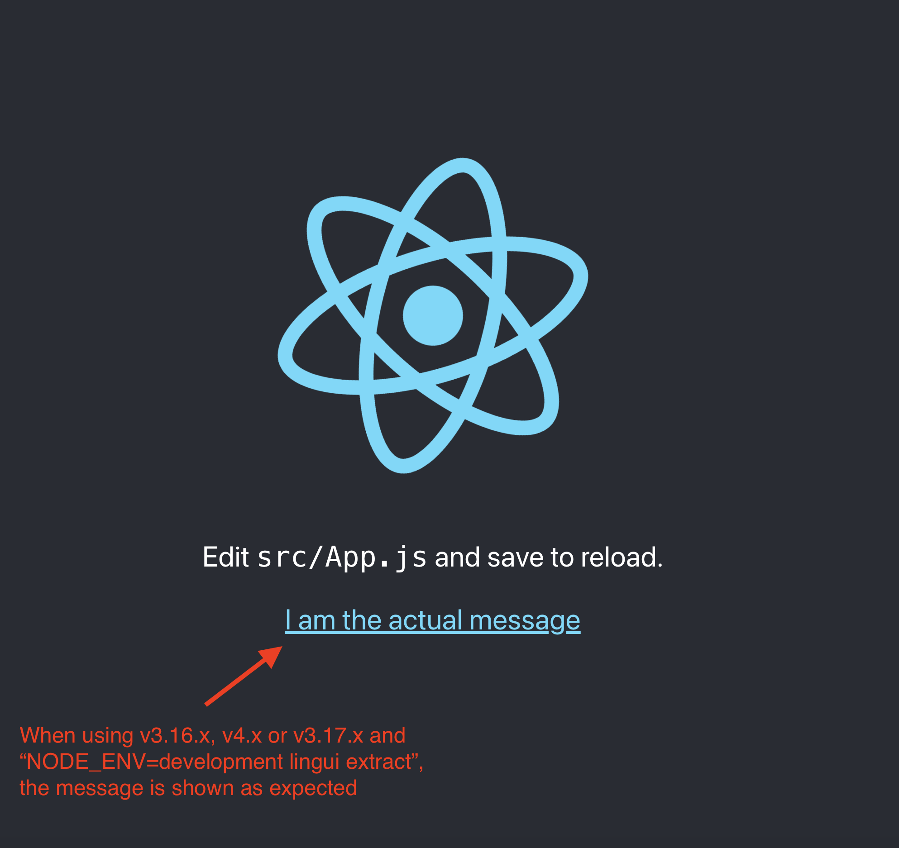

# Demo of issue with Lingui extract in v3.17.x

## Description
This repository showcases an issue with Lingui v3.17.x.  
When using Lingui v3.17.x and `NODE_ENV=production lingui extract`, the macro usages like this 
```
t({ id: 'i_am_the_id', message: 'I am the actual message'})
```
result in the output of the id instead of the message. Please see the screenshots below.

When other versions of Lingui are used, like v3.16.x or 4.x, the issue does not reproduce — the message appears as expected.  
The issue also does not reproduce when using Lingui v3.17.x and `NODE_ENV=development lingui extract`.

## Launching the demo
1. Clone the repository
2. Call `npm run restart`
3. Launch http://localhost:3000 in the browser.
4. See the issue: id is shown instead of the message.

Notes:
- You can also call `npm run restart-dev-extract`. This way `NODE_ENV=development` will be used for `lingui extract`, and all the translation will work as expected for any Lingui version, including 3.17.x.
- You can switch to v3.16.x or v4.x branches, which use other Lingui versions. On those branches, you will always get the expected message both with `npm run restart` or `npm run restart-dev-extract`.

## Screenshots


